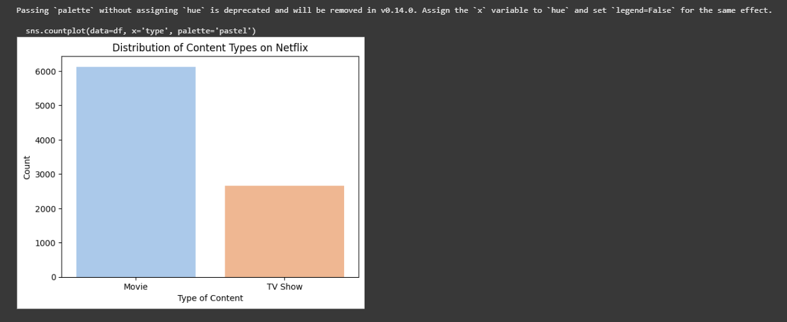
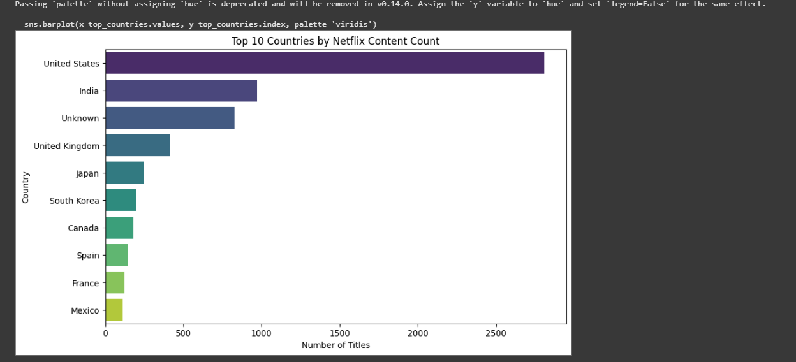
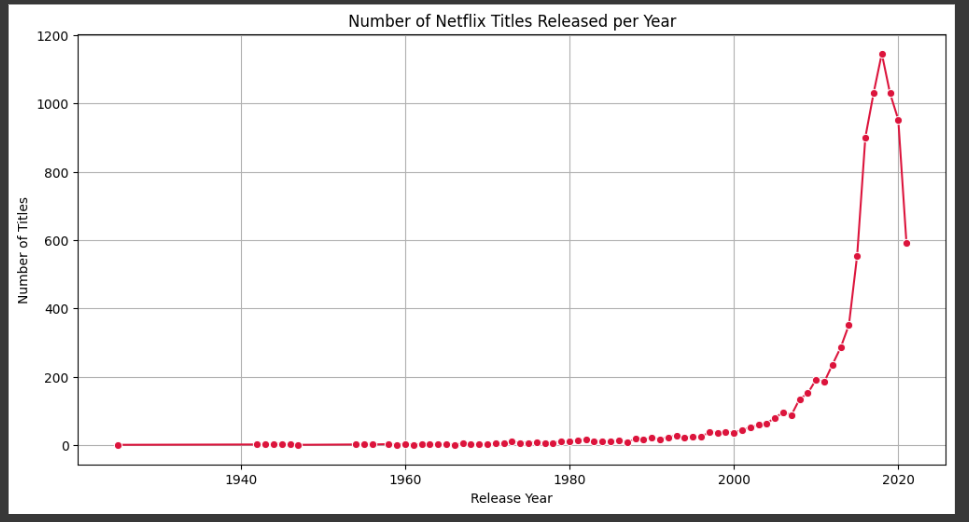
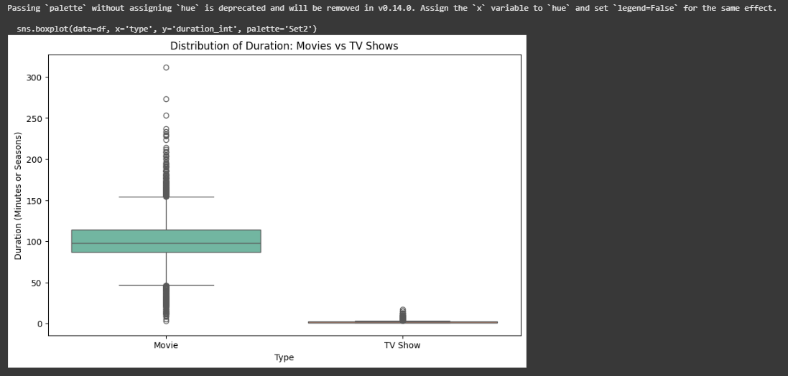
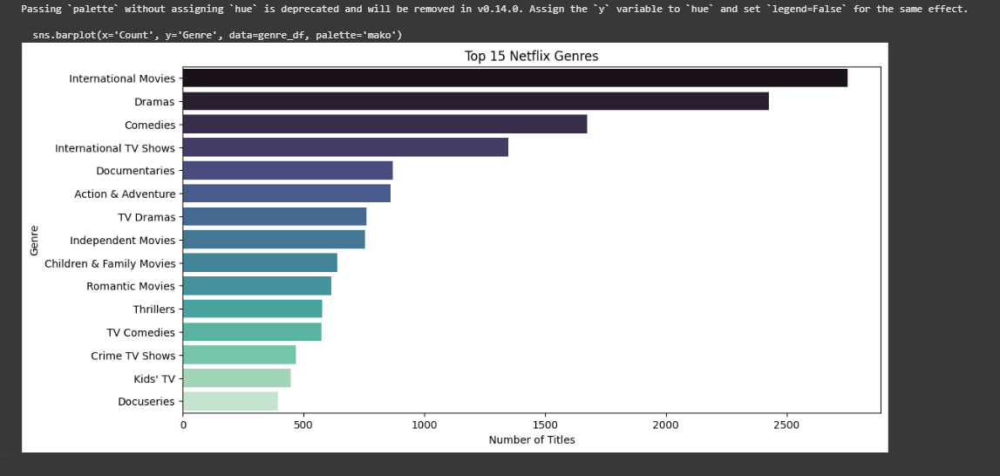

# Netflix EDA Project 📺

## 📊 Overview
This Exploratory Data Analysis (EDA) project analyzes Netflix's content library to uncover trends in content type, regional production, release years, genres, and duration.

## 📁 Dataset
- **Source**: [Netflix Titles Dataset (Kaggle)](https://www.kaggle.com/datasets/shivamb/netflix-shows)
- **File Used**: `netflix_titles.csv`

## 🛠 Tools Used
- Python
- Google Colab
- Pandas, Seaborn, Matplotlib

## 🔍 Key Insights
- **Movies** dominate Netflix’s catalog over TV Shows
- Most content originates from **United States**, followed by **India**
- Significant content growth observed between **2015–2019**
- **Dramas**, **Documentaries**, and **Comedies** are the most common genres
- Movies vary in length while most TV shows have **1–2 seasons**

---

## 📸 Visualizations

### ▶️ 1. Movies vs TV Shows

### 🌍 2. Top 10 Content-Producing Countries

### 📈 3. Content Growth Over Time

### ⏱️ 4. Duration: Movies vs TV Shows

### 🎭 5. Genre Frequency

---

## 📂 Files Included
- `netflix_eda_project.ipynb` – Jupyter Notebook with full analysis
- `README.md` – Project summary
- `images/` – Folder containing all visual plots

---

## 👩‍💻 Author
**Parashmita Roy Chowdhury**

